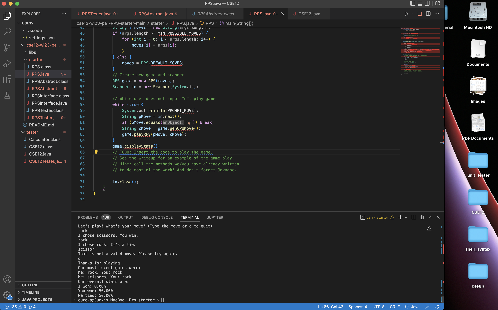
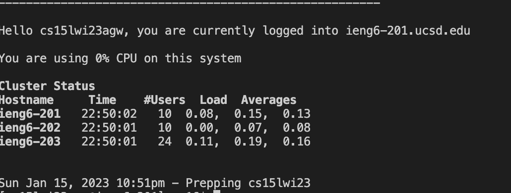
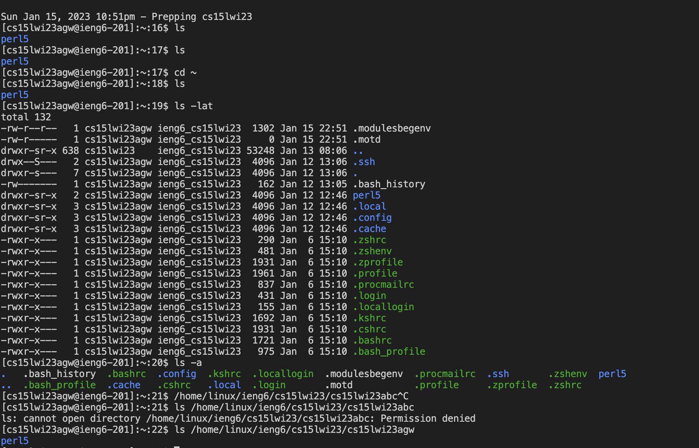

# Lab Report 1

## Download VScode
---
1. Use the link: [Download VScode](https://code.visualstudio.com/) and follow the instruction to download VScode.
2. Open VScode and go to terminal at the bottom. This is where you input commands in terminal

## Remotely connecting
---
1. Look up the cse15l account distributed to every cse15l student using this link: [Look up your account!](https://sdacs.ucsd.edu/~icc/index.php)
2. Reset the password following these instructions: [Change Your passwords](https://docs.google.com/document/d/1hs7CyQeh-MdUfM9uv99i8tqfneos6Y8bDU0uhn1wqho/edit)
3. using command `$ ssh cs15lwi23zz@ieng6.ucsd.edu` to connect to the remote server, in which *zz* should be replaced by alphabets of your own account and after connecting to the server, following should be printed to the terminal

## Trying some commands
---
* `cd ~` change directory to the home directory
* `ls` list the components of the current directory
* `ls -lat` showing the modify information of each file
* `ls -a` list the component of .file of current directory
* `ls <directory>` list the components of directory
* `cp /home/linux/ieng6/cs15lwi23/public/hello.txt ~/` copy the hello.txt of its original directory to home directory.
* `cat /home/linux/ieng6/cs15lwi23/public/hello.txt` print the content of hello.txt in this directory

