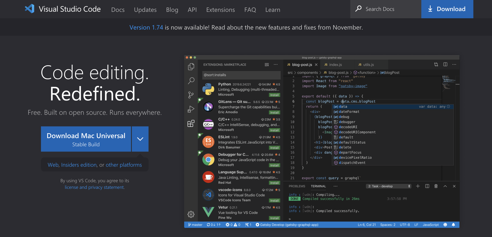
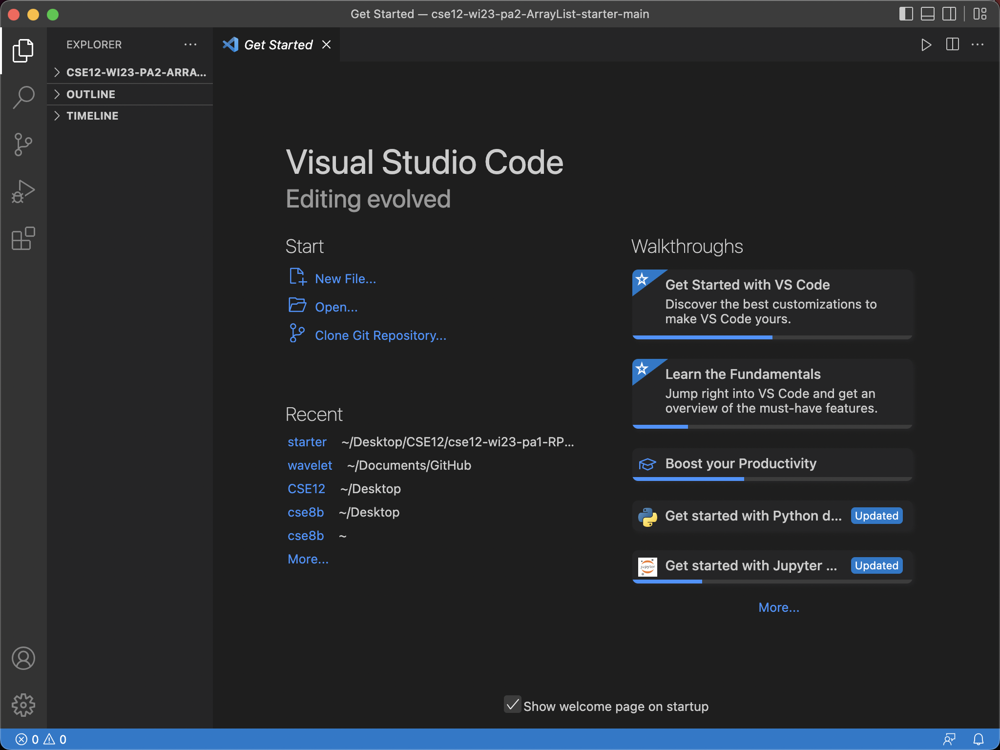
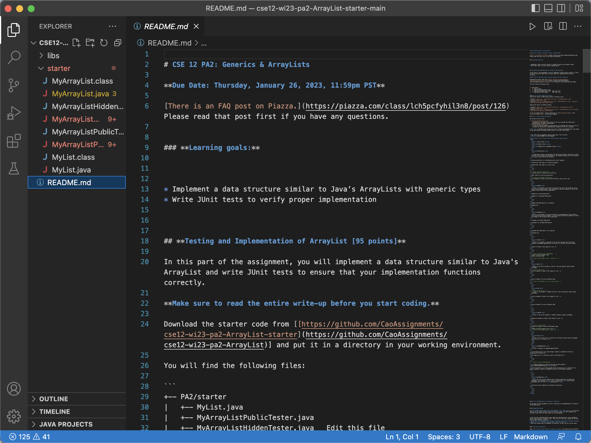
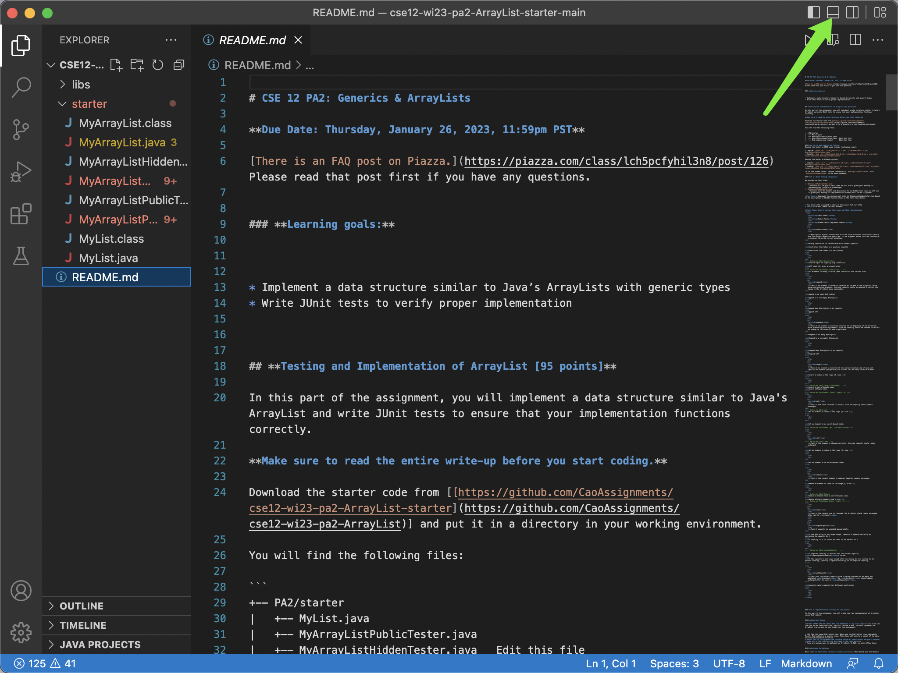
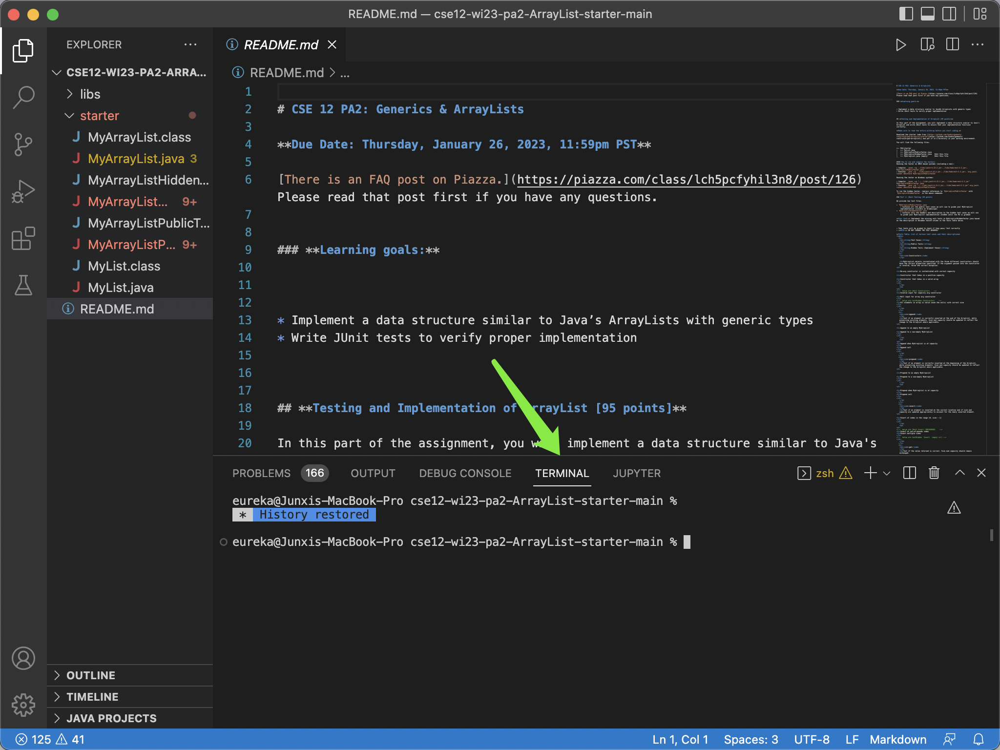
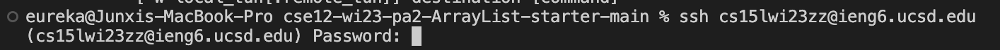

# Lab Report 1

## Download VScode
---
1. Use the link: [Download VScode](https://code.visualstudio.com/) and follow the instruction to download VScode.
  * Once navigating to the link provided above, click on the blue button to download VScode if you are using a mac computer.
  * If you are using windows, click on the down arrow on the blue button to select **download for windows**

  * Once VScode is successfully downloaded, click on the icon of VScode to open it. Once opened, you will see something like image below.

  * Our goal for now is to open the terminal in VScode. So we should first create or open a file using VScode by clicking *new file* or *open* in the picture. 
  * Once the text editor of Vscode is opened up, we see the UI like this
 
  * Now we are able to edit file with VScode. But how do we open terminal in Vscode? Let's take a look to the picture below

  * When we click the icon that the green arrow points to, we see a window at the bottom of our vscode window pops up just like shown below, once we click it, we are able to use terminal in the Vscode.

2. Open VScode and go to terminal at the bottom. This is where you input commands in terminal

## Remotely connecting
---
1. Look up the cse15l account distributed to every cse15l student using this link: [Look up your account!](https://sdacs.ucsd.edu/~icc/index.php)
2. Reset the password following these instructions: [Change Your passwords](https://docs.google.com/document/d/1hs7CyQeh-MdUfM9uv99i8tqfneos6Y8bDU0uhn1wqho/edit)
3. Typing command `$ ssh cs15lwi23zz@ieng6.ucsd.edu` in to any path in the terminal will allow you to connect to the remote server, in which *zz* should be replaced by alphabets of your own account and after typing this command into the terminal, it will ask you to input the password you just set for your account.

4. For the first several times, though the password you type might be correct, you may fail to connect several times, that's because it takes several minutes for the server to process the password you just set. Once you successfully log into your own server, following should be printed to the terminal

## Trying some commands
---
* `cd ~` change directory to the home directory
* `ls` list the components of the current directory
* `ls -lat` showing the modify information of each file
* `ls -a` list the component of .file of current directory
* `ls <directory>` list the components of directory
* `cp /home/linux/ieng6/cs15lwi23/public/hello.txt ~/` copy the hello.txt of its original directory to home directory.
* `cat /home/linux/ieng6/cs15lwi23/public/hello.txt` print the content of hello.txt in this directory

---
### That's all for today's lab report

